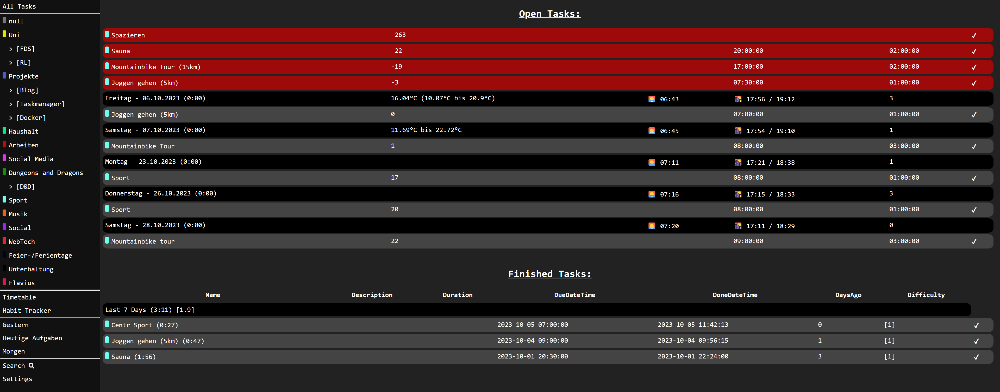
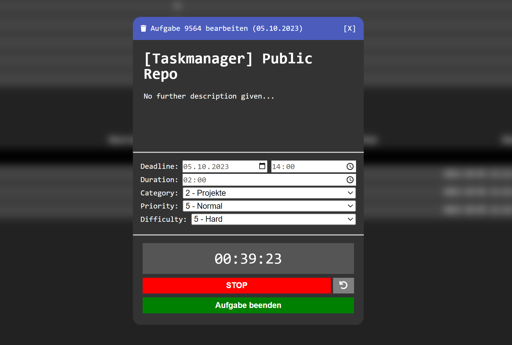
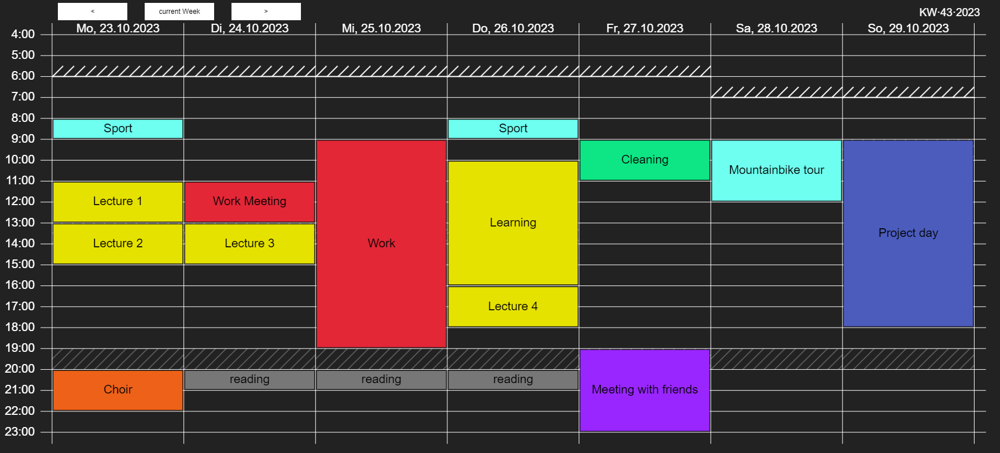

 

# Taskmanager

In our modern digital and fast-paced world, we are constantly inundated with information and tasks. This can lead to overwhelm and loss of productivity, as it becomes difficult to maintain an overview and focus on what is important. This project aims to help overcome this challenge. For this purpose, a smart todo list with time management features shall be provided, helping users to organize their tasks, set priorities and process them efficiently. Thus, it helps to cope with the challenges of digital acceleration and enables people to stay in control of their lives in the digital world.

Join us on [Discord](https://discord.gg/juDqrgRUZa)!

## Getting started

```shell
curl -sSL https://raw.githubusercontent.com/derfelix42/Taskmanager/master/documentation/rpi-setup.sh | sudo bash
```

### Most important steps for a manual install:

Clone this repo onto your machine of choice running docker and docker compose:

`git clone https://github.com/derfelix42/Taskmanager.git`

Then go into the newly created folder `Taskmanager` and simply run:

`docker compose up`

Change your password by updating the `.htpasswd` file!

Get more information in the dedicated [Getting started](documentation/getting-started.md) guide.

## Features
Here is a list of currently working feature of this Project. 

### Todo List
The Todo List is the original view of this todo app as you can see in the screenshot below. On the right side you can see the list of all tasks (in the category sport, more on categories and prefixes later). All tasks are grouped by the day they are due, exept for overdue tasks, these get grouped at the top, all with a red background. At the bottom are tasks marked as done of the last 7 days grouped together. Each task is clickable, opening the Task Modal explained in the next section.



### Task Modal
The task modal is the main editing point for tasks. It can be used to create new or edit existing tasks. Each task has a Name, Description, Location (simple string), a Deadline (due date and due time), a expected Duration, a Category, a Priority and a Difficulty. Also the time tracker can be started and stop. Marking a Task as done is also done here.



### Categories and Prefixes
Each Task can be assigned to a category. This allows differentiation between different areas of life. For example categories such as "Sport", "University", "Work", "Social", "Projects", "Music" could be used. Each Category has a distinc color to easily differentiate them on sight.

Prefixes can be used to further divide tasks into subcategories. A Prefix is simply a term enclosed in square brackets. For example each Lecture in University may have its own prefix like: `[AI] Lecture`, `[AI] Tutorial` and `[WEB] Lecture`, `[WEB] Exercise sheet`. If 2 or more tasks have the same Prefix, it is shown as a subcategory in the sidebar, being clickable and showing only tasks with this prefix.
[See Screenshot](documentation/screenshots/Sidebar_categories_prefixes.png).

### Timetable
The timetable displays a week overview of all tasks that have a due date, start time and planned duration. This can be used to time block the weeks ahead. Also for tasks that are in the past, their tracked times are displayed to easily see what happend when last week.




### Other notable features
- Smarthome integration (start/stop/get current/set Tasks from Smarthome)

- Automated Backups - once per day the entire database is dumped into a json file and stored on disk. (In future versions this might be automatically uploaded into some cloud storage)
- Cron Automations - currently executing MySQL statements to create default Tasks for next day, mark worked on tasks as done in the night, auto transfer high priority tasks to next day and anything else you can write with MySQL.


## Future Features
Here is a small overview of ideas as future features. Some are actively worked on - you can find their status as issues. If you have an idea / feature request, you can simply open an issue with tag "enhancement".
- Habit Tracker (in development)
- Action History (protocol of who did what and when)
- Timer (like a reminder: do this in X time)
- Notifications
- Import Backups to migrate easily to another host machine
- Search Feature to find past and/or future tasks / categories / priorities
- Statistics
- Better Login / Authentication methods
- Sharing Calendars with others
- More Automations
- Project Management (Task associations / dependencies)
- Module architecture to support 3rd party plugins to add in more data
- Location tracking for devices to automatically start/stop tasks based on location
- Rework / Add in new Views for Days, Weeks, Months, Quaters, Years, Custom